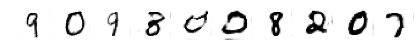

# Generating handwritten digits with Generative Adversarial Network using Keras.

This is the final project for completion of Data Science bootcamp organized by Sages. The goal of the project is to generate images of handwritten digits. 

Projects consists of six parts:
1. Preparation
2. Building components of GAN
3. Training algorithm
4. Training the network
5. Generate images with GAN
6. Loss finction and accuracy

