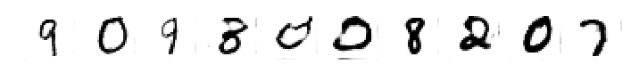

# Generating handwritten digits with Generative Adversarial Network using Keras.

This is the final project for completion of Data Science bootcamp organized by Sages. The goal of the project is to generate images of handwritten digits. 

We use Generative Adversarial Network which is a type of neural network consisting of two partial networks: generator and discriminator. These parts work 'against' each other like 'policeman' and 'forger'. Generator playing part of the forger creates images which are passed to the discriminator playing role of policeman. Discriminator is given real images of handwritten digits which are labeled with 1 and fake images generated by generator labeled with 0. Discriminator is binary classificator trained on these data. After discriminator training phase we train generator so that trained discriminator classify fake images as real. 

Data of real handwritten digits used in the project is MNIST dataset consisting of 60000 images of size 28*28 pixels.

Technologies used in the project are:
* Python 3.6
* Jupyter Notebook
* Keras (with Tensorflow backend)
* NumPy
* matplotlib

Projects consists of six parts:
1. Preparation
2. Building components of GAN
3. Training algorithm
4. Training the network
5. Generate images with GAN
6. Loss function and accuracy

Below we can see resulting images generated by our network:

